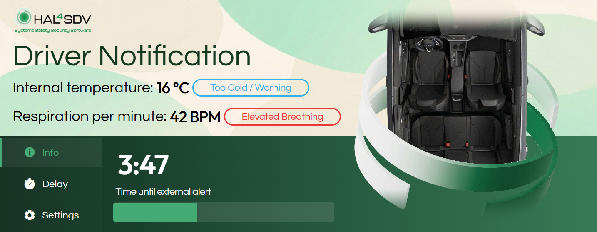
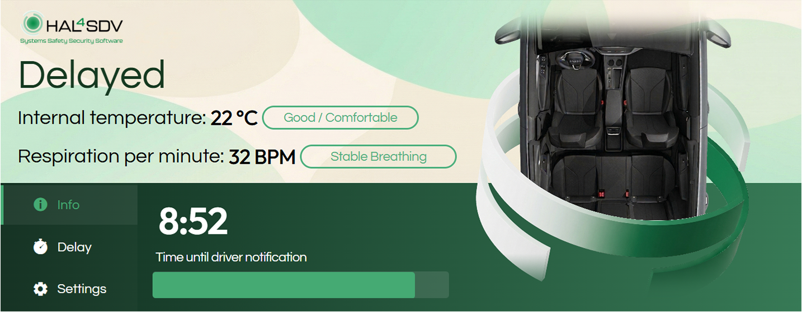
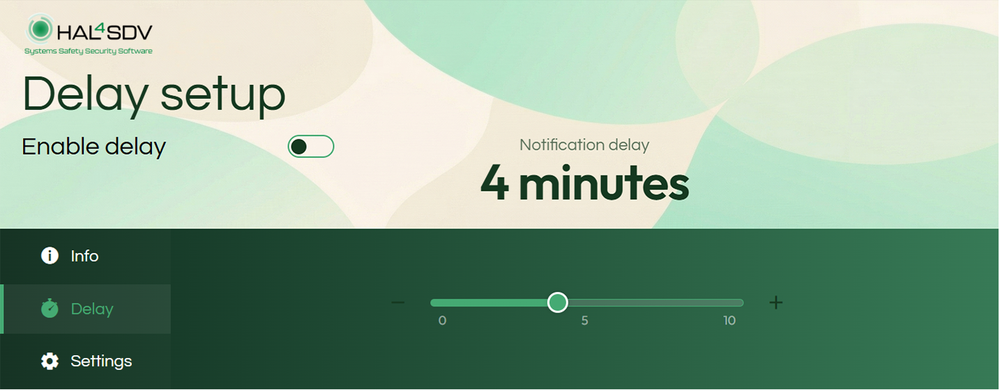
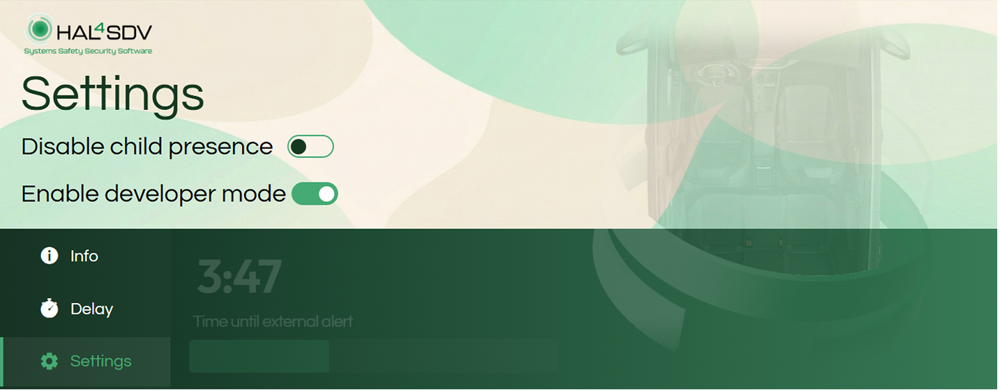

# HAL4SDV-CPD-Panel Child Presence Detection (CPD) – Notification Panel

## About the Project
This repository contains the source code for an interactive in-vehicle notification panel (HMI) designed to monitor and visualize the status of the Child Presence Detection (CPD) system. The application evaluates data from integrated vehicle sensors in real time, providing the driver and emergency systems with up-to-date information regarding the interior status (e.g., seat occupancy, temperature, breathing detection, and the countdown to alarm escalation).

The solution is built upon the **VSS (Vehicle Signal Specification)** standard and utilizes the **KUKSA Databroker** for data acquisition. State changes are distributed to the user interface via Server-Sent Events (SSE) and synchronized with a remote cloud environment using the secure MQTT (v5.0) protocol.

## Screenshots

Here is a preview of the panel in action:






---

## Utilized VSS Signals

The application actively subscribes to and evaluates the following VSS signals:

### System States and Notifications (CPD)
* `Vehicle.Cabin.ChildPresenceDetection.SystemStatus` (String) – Current phase of the system (e.g., *SCAN*, *DRIVER_NOTIFICATION*, *INTERVENTION*).
* `Vehicle.Cabin.ChildPresenceDetection.IsCPDSystemActive` (Bool) – CPD system activity indicator. Option to turn CPD off.
* `Vehicle.Cabin.ChildPresenceDetection.NotificationTime` (Int) – Remaining time until the next escalation phase (in seconds).
* `Vehicle.Cabin.ChildPresenceDetection.DelayNotification` (Int) – User-defined notification delay time.
* `Vehicle.Cabin.ChildPresenceDetection.IsDeveloperOptionActive` (Bool) – HMI developer mode activation flag.

### Sensors and Environment
* `Vehicle.Cabin.ChildPresenceDetection.UWBBreathing` (Int) – UWB detection of micro-movements/breathing in the cabin.
* `Vehicle.Cabin.HVAC.AmbientAirTemperature` (Int) – Current ambient air temperature inside the vehicle.

### Seat Occupancy
* `Vehicle.Cabin.Seat.Row1.DriverSide.Occupant.Identifier.Issuer` (Bool)
* `Vehicle.Cabin.Seat.Row1.PassengerSide.Occupant.Identifier.Issuer` (Bool)
* `Vehicle.Cabin.Seat.Row2.DriverSide.Occupant.Identifier.Issuer` (Bool)
* `Vehicle.Cabin.Seat.Row2.Middle.Occupant.Identifier.Issuer` (Bool)
* `Vehicle.Cabin.Seat.Row2.PassengerSide.Occupant.Identifier.Issuer` (Bool)

---

## Architecture and Technologies

* **Backend:** Node.js, Express.js
* **Vehicle Communication:** KUKSA Databroker CLI (integrated via Docker and `node-pty`)
* **Cloud Telemetry:** MQTT.js (connecting to HiveMQ Cloud via port 8883)
* **Frontend Updates:** Server-Sent Events (SSE) for a unidirectional real-time data stream to the UI, eliminating the need for client-side polling.

---

## Prerequisites

Before running the project, ensure the host machine meets the following requirements:
1. **Node.js** (version 16.x LTS or newer recommended).
2. **Docker** (a running Docker daemon is strictly required to execute the `kuksa-databroker-cli`).
3. **Running Databroker:** An actively running instance of the **KUKSA Databroker** configured with the custom project VSS.
4. Internet access for outbound MQTT communication (TCP port 8883).

---

## Installation and Configuration

**1. Clone the repository and install dependencies**
```bash
git clone <repository-url>
cd <project-directory>
npm install
```

**2. Environment Configuration:**
In the main execution file (`server.js`), verify and adjust the network connection variables for the KUKSA Databroker:
```javascript
const BROKER = "kuksa";         // Target Docker network name
const SERVER = "Server";        // IP address or hostname of the Databroker server
const HOST = "0.0.0.0";         // Web server interface binding
const PORT = 3000;              // Web server listening port
```
*Security Note: MQTT broker credentials (Username, Password, ClientID) are currently defined in the header of the main file. For production deployments, it is highly recommended to migrate these to a secure `.env` file.*

**3. Start the KUKSA Databroker (Mandatory):**
Before starting the Node.js application, you must launch your own KUKSA Databroker instance populated with the custom VSS file (`TUO_MEB_vss.json`). Run the following command, ensuring you replace `/path/to/your/` with the actual absolute path to the `.json` file on your host machine:

```bash
sudo docker run -it --rm \
  --name Server \
  --network kuksa \
  -v /path/to/your/TUO_MEB_vss.json:/config/vss.json \
  ghcr.io/eclipse-kuksa/kuksa-databroker:main \
  --insecure \
  --vss /config/vss.json
```

---

## Running the Application

Once the Databroker is successfully running, open a new terminal window/tab and execute the following command to start the production server:
```bash
node server.js
```

Upon a successful launch, the application will automatically:
1. Establish a secure connection with the remote MQTT broker.
2. Start the Express web server on port `3000`.
3. Spawn a Docker container running the KUKSA CLI client.
4. Initiate VSS signal subscriptions and begin processing telemetry data.

### Accessing the Dashboard
Open a standard web browser and navigate to:  
`http://localhost:3000`  
*(Or replace `localhost` with the corresponding IP address of the host machine if accessing remotely).*

---

## API Endpoint Structure

The Node.js backend provides the following internal REST and SSE endpoints to serve the frontend HMI:

* **`GET /events`** An SSE (Server-Sent Events) stream delivering real-time vehicle state updates to the UI.
* **`GET /state`** Returns a static JSON object containing the latest cached state of all subscribed VSS signals.
* **`POST /publish`** Used by the frontend to send actuation commands or data back to the KUKSA Databroker (e.g., setting the `DelayNotification` timer).  
  **Expected Payload:** ```json
  {
    "path": "Vehicle.Cabin.ChildPresenceDetection.DelayNotification",
    "value": 300
  }
